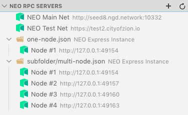
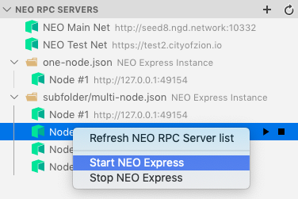
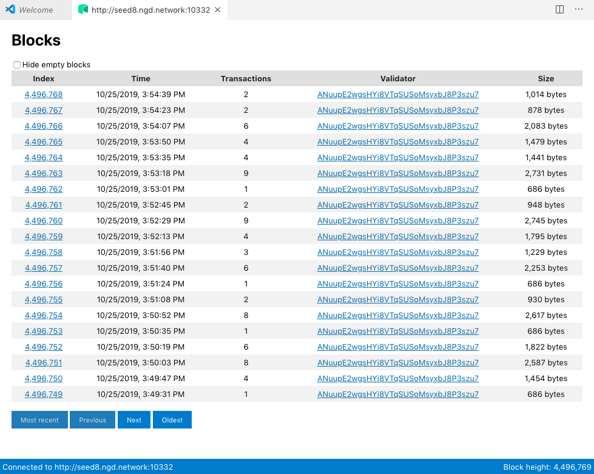

# NEO-Express Visual DevTracker

This is a Visual Studio Code extension that supports running and interacting with NEO-Express instances from within
vscode.

## Features

* Automatic detection of NEO-Express configuration files in the vscode workspace

* Start and stop NEO-Express instances from within vscode

* View NEO-Express output within vscode

* Explore the blockchain from within vscode (works for NEO-Express private blockchains and the public NEO blockchain)

## Requirements

NEO-Express must be installed, see: https://github.com/neo-project/neo-express
